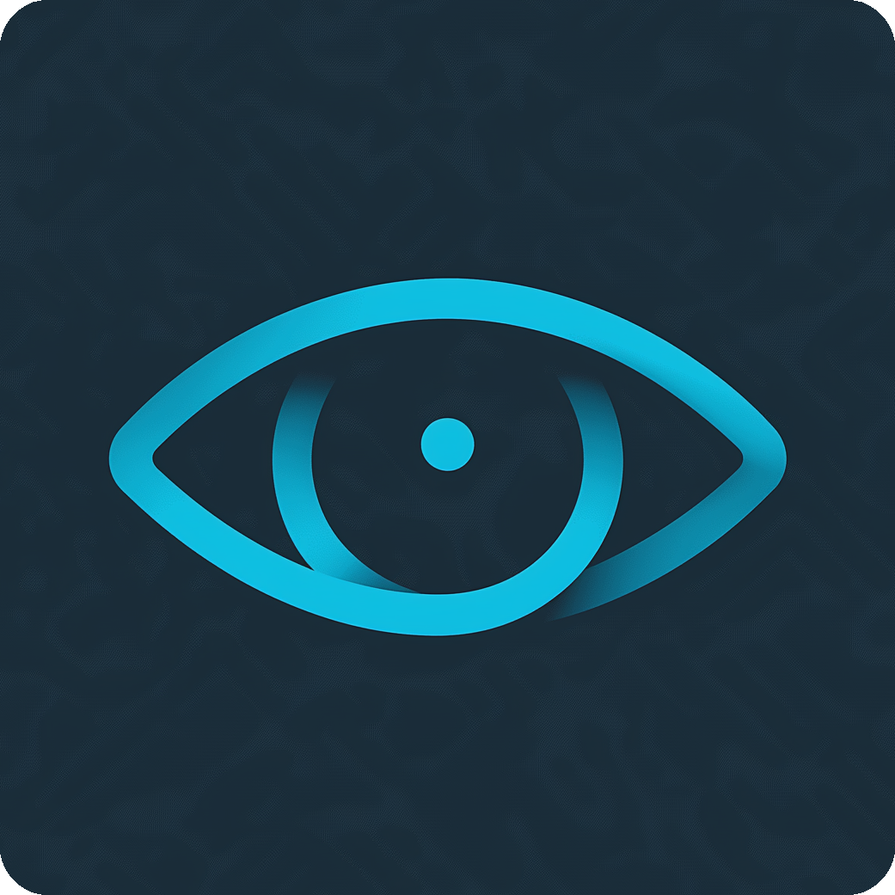
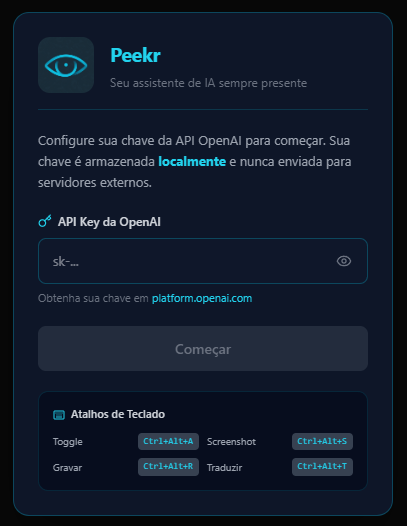
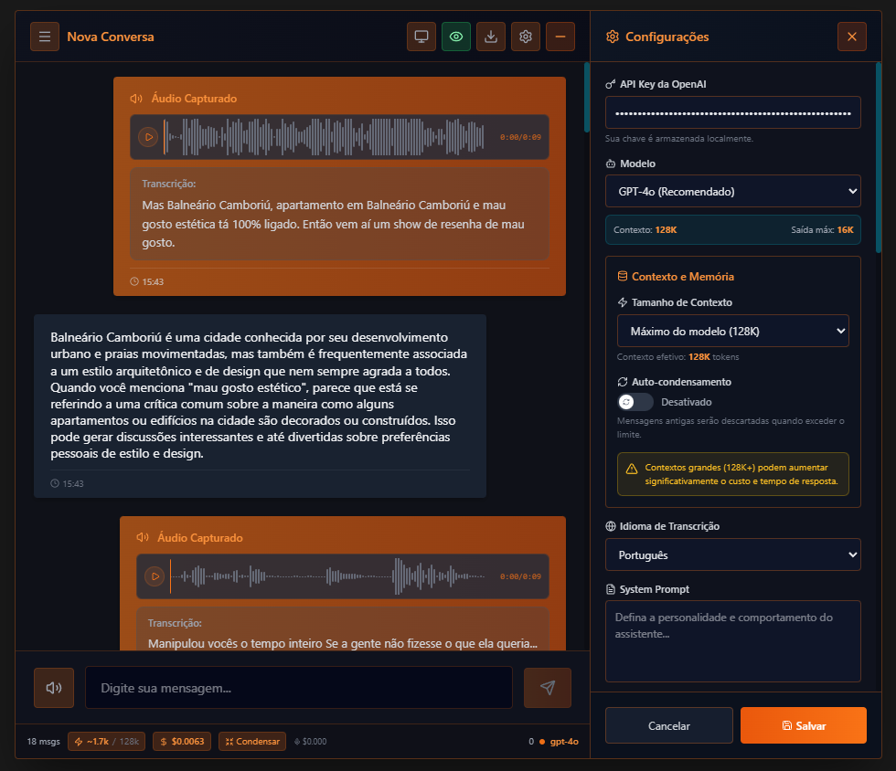
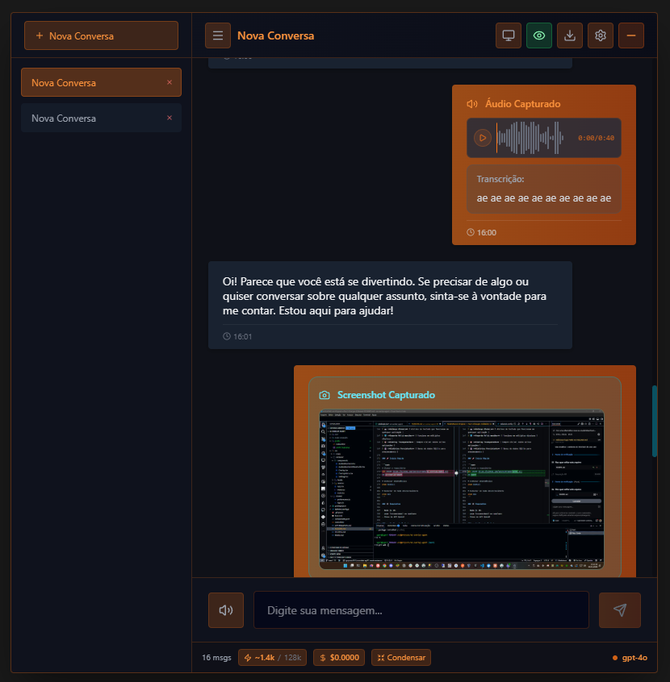
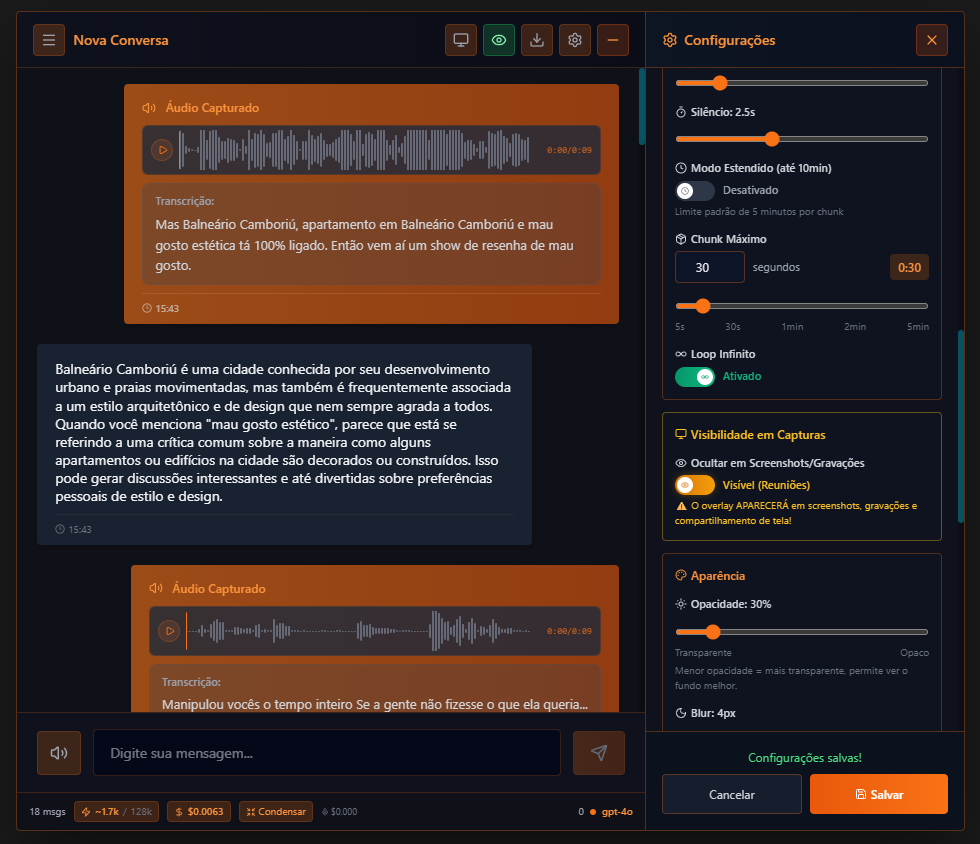
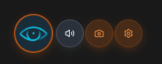

# Peekr 👁️

<div align="center">




**Your AI assistant that peeks over your shoulder — always ready to help**

*Um assistente de IA que espia por cima do seu ombro — sempre pronto para ajudar*

[English](#english) | [Português](#português)

</div>

---

## 📸 Screenshots

<div align="center">

### Initial Setup / Configuração Inicial


*Enter your OpenAI API key to get started / Digite sua chave da API OpenAI para começar*

### Main Interface / Interface Principal


*AI conversation with settings panel / Conversa com IA e painel de configurações*

### Conversation List / Lista de Conversas


*Multiple conversations sidebar / Barra lateral com múltiplas conversas*

### Settings & Customization / Configurações e Personalização


*Customize appearance, audio settings, and more / Personalize aparência, configurações de áudio e mais*

### Minimized Overlay / Overlay Minimizado


*Compact floating button with quick actions / Botão flutuante compacto com ações rápidas*

</div>

---

## � About This Project / Sobre Este Projeto

> **🎓 Educational & Open Source Project**
> 
> This project was created for **learning purposes** and to **help people** who need a simple AI assistant application. It's not intended for commercial use — just a tool to assist students, developers, and anyone who wants to learn or needs help with daily tasks.
>
> **🎓 Projeto Educacional & Open Source**
> 
> Este projeto foi criado para **fins de aprendizado** e para **ajudar pessoas** que precisam de uma aplicação simples de assistente de IA. Não é destinado para uso comercial — apenas uma ferramenta para auxiliar estudantes, desenvolvedores e qualquer pessoa que queira aprender ou precise de ajuda com tarefas do dia a dia.

---

## English

### 🎯 Overview

**Peekr** is a simple, open-source desktop application that provides an always-on-top AI assistant overlay. Think of it as having a helpful friend peeking over your shoulder, ready to assist with:

- 📝 Taking notes during meetings
- 🌐 Real-time translation
- 📸 Analyzing what's on your screen
- 💬 Quick AI conversations

### ✨ Features

| Feature | Description |
|---------|-------------|
| 🎙️ **Voice Recording** | Record audio with microphone and system audio capture |
| 🔊 **Audio Waveform** | Beautiful waveform visualization using WaveSurfer.js |
| 📸 **Screenshot Analysis** | Capture and analyze screenshots with GPT-4 Vision |
| 🌐 **Real-time Translation** | Translate conversations and content on-the-fly |
| 💬 **AI Chat** | Stream responses from OpenAI in real-time |
| 📝 **Export Conversations** | Export chat history as Markdown, JSON, or TXT |
| ⌨️ **Global Hotkeys** | Keyboard shortcuts that work in any application |
| 🖥️ **Multi-monitor Support** | Works across multiple displays |
| 🎨 **Transparent Overlay** | Always visible on top of other applications |
| 💾 **Persistent History** | SQLite database for conversation storage |

### 🚀 Getting Started

This project is meant to be run in **development mode**. There's no production build or installer — just clone and run!

```bash
# Clone the repository
git clone https://github.com/igorjunio2015/Peekr.git
cd Peekr

# Install dependencies
pnpm install

# Run the application
pnpm dev
```

### ⚙️ Requirements

- Node.js 18+
- pnpm (recommended) or npm/yarn
- OpenAI API Key (get yours at [platform.openai.com](https://platform.openai.com/api-keys))

### ⌨️ Hotkeys

| Shortcut | Action |
|----------|--------|
| `Ctrl+Alt+A` | Toggle overlay visibility |
| `Ctrl+Alt+S` | Capture screenshot and analyze |
| `Ctrl+Alt+R` | Start/Stop recording |
| `Ctrl+Alt+T` | Toggle translation mode |

### 🛠️ Tech Stack (for learning)

This project is a great way to learn about:

- **Electron** - Building desktop apps with web technologies
- **React 18** - Modern React with hooks
- **TypeScript** - Type-safe JavaScript
- **TailwindCSS** - Utility-first CSS
- **WaveSurfer.js** - Audio visualization
- **OpenAI API** - AI integration (GPT-4, Vision, Whisper)
- **SQLite** - Local database with better-sqlite3
- **Vite** - Fast development server

### 🔒 Privacy & Security

- ✅ API keys stored locally only
- ✅ No data sent to external servers (except OpenAI API)
- ✅ No telemetry or tracking
- ✅ Electron security best practices

### 🤝 Contributing

This is an open project for learning! Feel free to:

1. Fork and experiment
2. Open issues with questions
3. Submit PRs with improvements
4. Share with others who might find it useful

### 📄 License

MIT License - Use it, learn from it, share it!

---

## Português

### 🎯 Visão Geral

**Peekr** é uma aplicação desktop simples e open source que fornece um assistente de IA sempre visível sobre outras janelas. Pense nele como um amigo prestativo espiando por cima do seu ombro, pronto para ajudar com:

- 📝 Fazer anotações durante reuniões
- 🌐 Tradução em tempo real
- 📸 Analisar o que está na sua tela
- 💬 Conversas rápidas com IA

### ✨ Funcionalidades

| Funcionalidade | Descrição |
|----------------|-----------|
| 🎙️ **Gravação de Voz** | Grave áudio com microfone e captura de áudio do sistema |
| 🔊 **Waveform de Áudio** | Visualização bonita de ondas usando WaveSurfer.js |
| 📸 **Análise de Screenshots** | Capture e analise screenshots com GPT-4 Vision |
| 🌐 **Tradução em Tempo Real** | Traduza conversas e conteúdo instantaneamente |
| 💬 **Chat com IA** | Respostas em streaming da OpenAI em tempo real |
| 📝 **Exportar Conversas** | Exporte histórico como Markdown, JSON ou TXT |
| ⌨️ **Hotkeys Globais** | Atalhos de teclado que funcionam em qualquer aplicação |
| 🖥️ **Suporte Multi-monitor** | Funciona em múltiplos displays |
| 🎨 **Overlay Transparente** | Sempre visível sobre outras aplicações |
| 💾 **Histórico Persistente** | Banco de dados SQLite para armazenamento |

### 🚀 Como Começar

Este projeto é feito para rodar em **modo de desenvolvimento**. Não há build de produção ou instalador — apenas clone e rode!

```bash
# Clonar o repositório
git clone https://github.com/igorjunio2015/Peekr.git
cd Peekr

# Instalar dependências
pnpm install

# Rodar a aplicação
pnpm dev
```

### ⚙️ Requisitos

- Node.js 18+
- pnpm (recomendado) ou npm/yarn
- Chave de API OpenAI (obtenha a sua em [platform.openai.com](https://platform.openai.com/api-keys))

### ⌨️ Atalhos de Teclado

| Atalho | Ação |
|--------|------|
| `Ctrl+Alt+A` | Ativar/Desativar overlay |
| `Ctrl+Alt+S` | Capturar screenshot e analisar |
| `Ctrl+Alt+R` | Iniciar/Parar gravação |
| `Ctrl+Alt+T` | Ativar modo tradução |

### 🛠️ Stack Tecnológico (para aprendizado)

Este projeto é uma ótima forma de aprender sobre:

- **Electron** - Construindo apps desktop com tecnologias web
- **React 18** - React moderno com hooks
- **TypeScript** - JavaScript com tipagem
- **TailwindCSS** - CSS utility-first
- **WaveSurfer.js** - Visualização de áudio
- **OpenAI API** - Integração com IA (GPT-4, Vision, Whisper)
- **SQLite** - Banco de dados local com better-sqlite3
- **Vite** - Servidor de desenvolvimento rápido

### 🔒 Privacidade & Segurança

- ✅ Chaves de API armazenadas apenas localmente
- ✅ Nenhum dado enviado para servidores externos (exceto API da OpenAI)
- ✅ Sem telemetria ou rastreamento
- ✅ Melhores práticas de segurança do Electron

### 🤝 Contribuindo

Este é um projeto aberto para aprendizado! Sinta-se à vontade para:

1. Fazer fork e experimentar
2. Abrir issues com dúvidas
3. Enviar PRs com melhorias
4. Compartilhar com outros que possam achar útil

### 📄 Licença

Licença MIT - Use, aprenda, compartilhe!

---

<div align="center">

**Made with ❤️ for learning and helping others**

*Feito com ❤️ para aprender e ajudar outros*

🎓 **Educational Project** | **Projeto Educacional** 🎓

[Report Bug](https://github.com/igorjunio2015/Peekr/issues) · [Request Feature](https://github.com/igorjunio2015/Peekr/issues)

</div>
